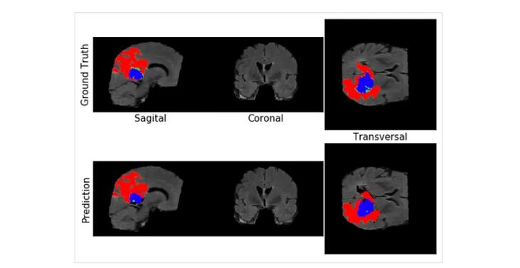

#  Brain Tumors Segmentation

Brain tumor segmentation using deep learning is a helpful tool for physicians to rapidly diagnose brain tumors. In this project, an encoder-decoder architecture is utilized to perform brain tumor segmentation. In particular, we investigated several mode reduction techniques to try to limit the number of input modalities needed to achieve good performance. We utilized pre-processed datasets to train and test, and also implemented our own processing pipeline by stripping the skulls from brain images collected by Stanford Health Care (SHC). The developed model was robust to reduction of imaging modes, and shows promise for future investigation in clinical environments.

